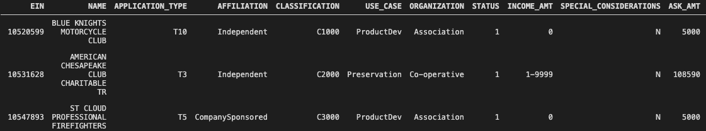
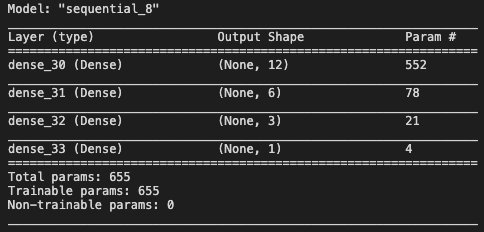
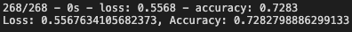

# Funding Analysis using Neural Networks

### Objective 
The objective of this project is to analyse past funding results to determine if the applicant organization will be able to successfully reach their goals. The analysis uses knowledge of Machine learning and neural networks to create a binary classifier that is capable of predicting the success of a funding project.

### Data and Inputs 
The following historical funding data is available for each asking organization  
 - Type of applicaiton
 - Affiliation
 - Classification
 - Use Case of Organization
 - Organization Status
 - Income Amount
 - Special considerations
 - Ask Amount
 - Was the organization successful           

### Resources
Data Source CSV file: Charity_data.csv
VS Code v 1.52.1
Python 3.7.9
Pandas library
Scikit-Learn library
TensorFlow v2.4.0 library

### Results
#### Preprocessing Data for Neural Network model
 - The target variable for the module is `IS SUCCESSFUL`, all the other columns are considered as feature columns. 
 - The `EIN` and `NAME` columns are removed since they do not play a part in the project success. 
 - All the categorical columns were appropriately binned and then run through one hot encoder. 
 - The preprocessing of the data results in 45 features which have been appropriately scaled. 

#### Compile, Train and Evaluate the model
 - The accuracy of the models for given test cases is provided below:

| Attempts| Hidden Layers | Neurons | Accuracy |
| :---:       |     :---:      |          :---: |         :---: |
| Case 1  | 2    | 10,5   |65.2%    |
 Case 2  | 2    | 15,7   |71.1%    |
  Case 3  | 3    | 8,5,3   |72.8%    |
   Case 4  | 3    | 12,6,3   |73.2%    |

### Summary
#### Model Summary

 - The final model selected consists of 3 hidden layers with 12, 6 and 3 neurons each. The activation function used for the middle layers was `relu` and the activation function used for the output layer is `sigmoid`. 
 - Increasing eh number of layers resulted in overfitting. The next steps should be to change the number of neurons further to get the highest possible accuracy and also try different activation functions to see how they affect the accuracy of the model. 
